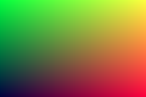
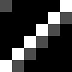

# SwissGL: Swiss Army knife for WebGL2

**[DEMO](http://google.github.io/swissgl)** | **[API](docs/API.md)** | **[Changelog](docs/CHANGELOG.md)**

SwissGL is a minimalistic wrapper on top of WebGL2 JS API. It's designed to reduce the amount of boilerplate code required to manage GLSL shaders, textures and framebuffers when making GPGPU-style procedural visualizations or simulations. See the [demos](demo/) for examples of using SwissGL. As of now the library consists of a standalone ~500 loc .js file.

**Disclaimer** This is not an officially supported Google product. SwissGL is an early stage experiment, incomplete and unstable. It's an invitation to discuss compact and expressive graphics library design, which I hope is relevant in light of the upcoming arrival of WebGPU.

## Quickstart

As of now, the library API consists of a single function object that does everything (like a Swiss Army knife). Here is a minimal example of using it to draw an animated gradient quad:

```HTML
<script src="swissgl.js"></script>
<canvas id="c" width="600" height="400"></canvas>
<script>
    const canvas = document.getElementById('c');
    const glsl = SwissGL(canvas);

    function render(t) {
        t /= 1000; // ms to sec
        glsl({t}, `UV,cos(t*TAU),1`);
        requestAnimationFrame(render);
    }
    render();
</script>
```


This line creates a SwissGL library instance that wraps a WebGL2 context of a given `canvas` element (you can also pass a WebGL2 context):
```js
const glsl = SwissGL(canvas);
```

Now we can already draw something:
```js
glsl({t}, `UV,cos(t*10.0),1`);
```
This line, called during the animation loop, creates a shader that evaluates the given expression string into RGBA-color for every pixel on the canvas. `vec2 UV` variable provides `[0,1]`-range normalized coordinates of the current pixel, and `ivec2 I` can be used to get integer coordinates. The shader is compiled and cached during the first call and reused later.


`glsl` function has at most three arguments, some of which can be omitted:
```js
glsl(params, code, target);
```
Please refer to the [API reference](docs/API.md) for the detailed explanation of their function. Let's now have a look at the more elaborate example of using SwissGL to implement a particle simulation.

## Particle Life

Inspired by the [beautiful video](https://youtu.be/p4YirERTVF0?t=481) by Tom Mohr, let's try reproduce the "snake" pattern shown there. Particle Life is made of particles of a few different types. All particles repel when they are closer than some distance $r$, but at around $2r$ the resulting (potentially non-symmetric) force is described by the special force matrix $F_{i,j}$, where $i,j$ are types of two particles. Positive $F$ corresponds to attraction and negative to repulsion. Let's create a texture that stores such a matrix. We can create an array on the JS side and pass it to SwissGL, but it's even easier to populate matrix values right on GPU:
```js
const K = 6; // number of particle types
const F = glsl(`
    float(I.x==I.y) + 0.1*float(I.x==I.y+1)`,
    {size:[K,K], format:'r16f'});
```

This creates a single channel float16 texture of size `[width,height]==[6,6]` and populates its values by evaluating the expression. `I` is a special variable of type `ivec2` that contains coordinates of the pixel being evaluated.

We can easily visualize the resulting texture to make sure everything is ok:
```js
glsl({F}, `F(I/20).x*3.0`);
```


Uniform textures can be accessed with usual GLSL functions, or with a helper macro that has the same name as the texture uniform. Passing `ivec2` as parameter makes it call `texelFetch()` to get a texel using the integer coordinates, passing `vec2` uses `texture()`, with filtering and wrapping.

The next step is to create a list of textures that is going to contain particle positions. Each pixel will contain a single particle position and type.
```js
const points = glsl({size:[30,10], story:3, format:'rgba32f', tag:'points'});
```
We are going to simulate 30*10=300 particles. Textures will have 4 channels (RGBA) of type float32. The `story:3` argument says that we need to create a cyclic buffer of three textures of the same format, so that we can read two consecutive states of the particle system (for momentum) to produce the third. We don't provide shader `code` to the SwissGL call, so we must specify the storage `tag`. Now we can initialize these textures:
```js
for (let i=0; i<2; ++i) {
    glsl({K, seed:123}, `
        vec2 pos = (hash(ivec3(I, seed)).xy-0.5)*10.0;
        float color = floor(UV.x*K);
        out0 = vec4(pos, 0.0, color);`,
        points);
}
```
The shader code above uses "multiline" shader `code` format instead of a single expression. The output must be written to a global variable `out0`. Variable `UV` has type `vec2` and provides `[0,1]`-range normalized coordinates of the current pixel. It is used to assign one of `K` "colors" to each particle. For convenience SwissGL provides a [simple hash](TODO) function `vec3 hash(ivec3)` that can be used as a deterministic random number generator.

Note that we are writing the same particle positions two times, which means that particles have zero velocity at initialization. Now `points[0]` and `points[1]` contain the same values, and `points[2]` is uninitialized and is going to be overwritten at the first simulation step.

Before we start modeling the particle dynamics it's a good idea to implement visualization. So far we've already seen "expression" and "multiline" shortcut `code` formats. Now we are going to write a `full` vertex-fragment shader pair:
```glsl
glsl({K, worldExtent,  // uniforms
      // reading the last state of 'points' texture
      points: points[0], 
      // render a quad instance for every 'points' texel
      Grid: points[0].size,
      // preserve the scale of xy-axes by fitting
      // [-1..1]x[-1..1] box into the view
      Aspect:'fit',
      // blend primitives using alpha transparency
      Blend: 'd*(1-sa)+s*sa'}, `

// the code below is available in both
// vertex and fragment shaders
varying vec3 color;

//VERT  start of vertex-only section
// vertex function is called 
vec4 vertex() {
    // get current particle data
    vec4 d = points(ID);
    // populate varyings to use in fragment shader
    color = cos((d.w/K+vec3(0,0.33,0.66))*TAU)*0.5+0.5;
    // emit normalized on-screen vertex position
    // 'vec2 XY' is contains coordinates of the quad vertex in -1..1 range
    return vec4(2.0*(d.xy+XY/8.0)/worldExtent, 0.0, 1.0);
}

//FRAG  start of fragment-only section
void fragment() {
    // Compute the fragment transparency depending
    // on the distance from the quad center.
    // Interpolated XY is also available in the fragment shader.
    float alpha = smoothstep(1.0, 0.6, length(XY));
    // set the fragment color
    out0 = vec4(color, alpha);
}`); // 'target' is omitted, so rendering to canvas
```

Running this code in the drawing loop produces the following image:


The vertex shader computes  WebGL [Clip Space](https://developer.mozilla.org/en-US/docs/Web/API/WebGL_API/WebGL_model_view_projection#clip_space) coordinates for each corner of each particle quad. We map particle positions from `[-worldExtent/2, worldExtent/2]` range to `[-1,1]` box. This shader also computes particle color using [cosine palettes trick](https://iquilezles.org/articles/palettes/) and passes it to the fragment shader along with the corner offset vector. The fragment shader calculates pixel opacity `alpha` using the distance form the particle center and sets `out0` variable. This way we can use low-level GLSL as an expressive, flexible and performant tool to render large numbers of primitives.

Now we can set particles in motion by writing the update shader that computes new particle positions each frame.
```glsl
glsl({F, worldExtent, repulsion, inertia, dt, // uniforms
      // The current state of the system is implicitly
      // available to the shader as 'Src' uniform if
      // the target has history (is an array of textures).
      // Here we explicitly pass the state one step at the past
      past:points[1]}, `
// this function wraps positions and velocities to
// [-worldExtent/2, worldExtent/2] range
vec3 wrap(vec3 p) {
    return (fract(p/worldExtent+0.5)-0.5)*worldExtent;
}
void fragment() {
    // read the current particle state
    out0 = Src(I);
    vec3 force=vec3(0); // force accumulator
    // iterate over particles
    for (int y=0; y<ViewSize.y; ++y)
    for (int x=0; x<ViewSize.x; ++x) {
        // reading the state of another particle
        vec4 data1 = Src(ivec2(x,y));
        vec3 dpos = wrap(data1.xyz-out0.xyz);
        // calculate distance
        float r = length(dpos);
        if (r>3.0) continue;
        dpos /= r+1e-8;
        // calculate repulsion and interaction forces
        float rep = max(1.0-r, 0.0)*repulsion;
        float f = F(ivec2(out0.w, data1.w)).x;
        float inter = f*max(1.0-abs(r-2.0), 0.0);
        force += dpos*(inter-rep);
    }
    // fetch the past state to compute velocity
    vec3 vel = wrap(out0.xyz-past(I).xyz)*pow(inertia, dt);
    // update particle position
    out0.xyz = wrap(out0.xyz+vel+0.5*force*(dt*dt));
}
`, points);  // using 'points' as the target
```

Soon randomly scattered particles self-assemble into a nice colorful snake! The simulation is happening on the GPU and is quite fast for the quadratic complexity algorithm (that iterates all particle pairs). Even mobile phones can run hundreds of steps per second. Thanks to SwissGL, orchestrating this computation, managing shaders and framebuffers takes minimal amount of boilerplate code.


## Links

Sources of wisdom:
* [Inigo Quilez](https://iquilezles.org/)
* [Steven Wittens](https://acko.net/)
* [WebGL](https://webglfundamentals.org/) / [WebGL2](https://webgl2fundamentals.org/) fundamentals

Playgrounds:
* [ShaderToy](https://www.shadertoy.com/)
* [twigl](https://twigl.app/)
* [vertexshaderart](https://www.vertexshaderart.com/)

Libraries
* [three.js](https://threejs.org/)
* [Use.GPU](https://usegpu.live/)
* [MathBox](https://github.com/unconed/mathbox)
* [twgljs](https://twgljs.org/)
* [regl](https://github.com/regl-project/regl)
* [gpu-io](https://github.com/amandaghassaei/gpu-io)
* [luma.gl](https://luma.gl/)
